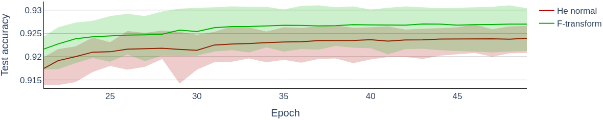
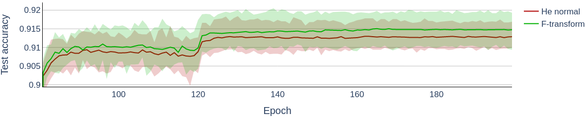
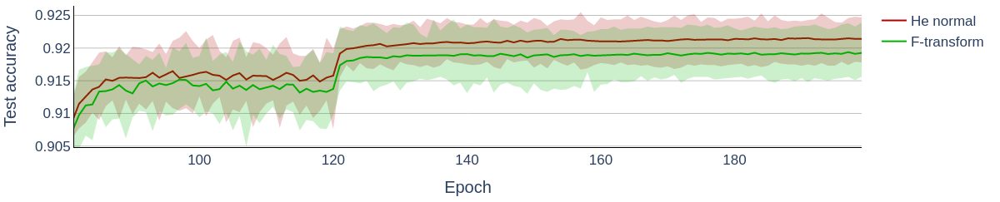
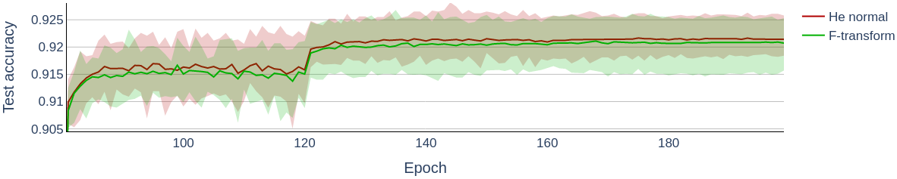

# FTInit

This repository contains source code for the initialization of convolutional layers in Keras. The initialization is based on Fuzzy modeling theory - Fuzzy transformation. 

The initialization samples weights from the pre-defined 2D F-transform kernels and stack them up to create a filter tensor. Initialization of the first convolutional layer is unfortunately limited to 8 filters, second to 512 filters and any subsequent layer is basically without restriction. The initialization has reached better val/test accuracy on several datasets/architectures:

## CIFAR-10 EfficientNetB0


## CIFAR-10 ResNet20


## CIFAR-10 ResNet32


## CIFAR-10 ResNet44


# Usage

FTInit requires `cv2, numpy, pillow, scipy`.

Example of usage:
```
import FtInit

init = ftinit.FtInit()

# This creates a filter tensor with shape [5,5,1,1] and print its values.
print(init([5,5,1,1], dtype=float))

# Creates keras Conv2D layer with FtInit initializer
Conv2D(num_filters, kernel_size=kernel_size, strides=strides, padding="same" kernel_initializer=FtInit(), kernel_regularizer=l2(1e-4))
```